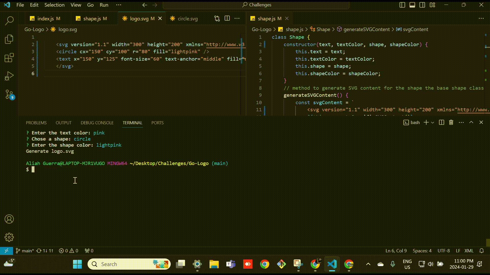

# Go-Logo

## Description
Go Logo is an application designed to generate professional SVG logos using a series of prompts (text, text color , shape and shape color), collecting the user inputs as data that corresponds with SVG structure. It uses the Inquirer package to dynamically generate the SVG file which can be viewed in the browser. 

## Table of contents
- [Installation](#installation)
- [Screenshot](#screenshot)
- [Features](#features)
- [Usage](#usage)
- [credits](#credits)
- [License](#license)
- [Contributing](#contributing)

## Installation
To install this project git clone https://github.com/AliahG97/Go-Logo.git

## Screenshot
 https://aliahg97.github.io/Go-Logo/

## Features

1. Prompts: The app prompts questions to the user for information about the SVG logo, guiding the user through the SVG logo creation process.

2. Structure: The application ensures that the logo file follows the SVG structure. Sections are organized according to text, text color , shape and shape color.

3. Shape options: The generator allows the user to choose a shape for the logo from the list of choices (circle, triangle, or square). It prompts the user to input a color for the shape, and then it adds the corresponding shape and color to the SVG logo file.

4. Text options: The generator allows the user to input a text of 3 or less characters for the logo as well as a color, and then it adds the corresponding text and color on top of the shape displayed in the SVG logo file when viewed in the browser.

5. View Logo: Once all prompted questions are answered, a new "logo.SVG" file will be created with the returned data. The user can open the file in a browser to be viewed the newly created svg logo image.

## Usage
Go Logo is ideal for any developers who want to create a professional logo or shape.

## Credits
Aliah Guerra (https://github.com/AliahG97)

## License
Creative Commons License
by Aliah Guerra2024. Confidential and Proprietary. All Rights Reserved.

## Contributing
- Add more shape options in the list of choices.

## Testing
1. Install npm jest in shape.test.js ile 
2. Select shape.test.js and open code
3. In the terminal type: npm t
4. Wait for test to run
5. All 3 tests should return test results as "passed"

